# 🍬 Sweet Shop Management System  
**Incubyte Assignment – AI Kata (Python Backend)**

A full-stack **Sweet Shop Management System** built using **Python (FastAPI)** and **React**, following **Test-Driven Development (TDD)**, clean code principles, and responsible **AI-assisted development**.

---

## 🎯 Objective

To design, build, and test a complete sweet shop system showcasing:
- Python-based REST APIs
- Database integration
- Authentication & authorization
- Frontend SPA development
- TDD workflow
- Git discipline and AI transparency

---

## 🏗️ Tech Stack

### Backend
- Python 3.10+, FastAPI
- JWT Authentication
- SQLAlchemy ORM
- PostgreSQL / SQLite
- Pytest, Pydantic
- Uvicorn

### Frontend
- React (Vite)
- Axios
- CSS / Tailwind
- Context API

---
## 📸 Screenshots

---

### 🎨 Frontend Screenshots

#### 🔐 Login Page

#### 📝 Register Page

#### 📊 User Dashboard
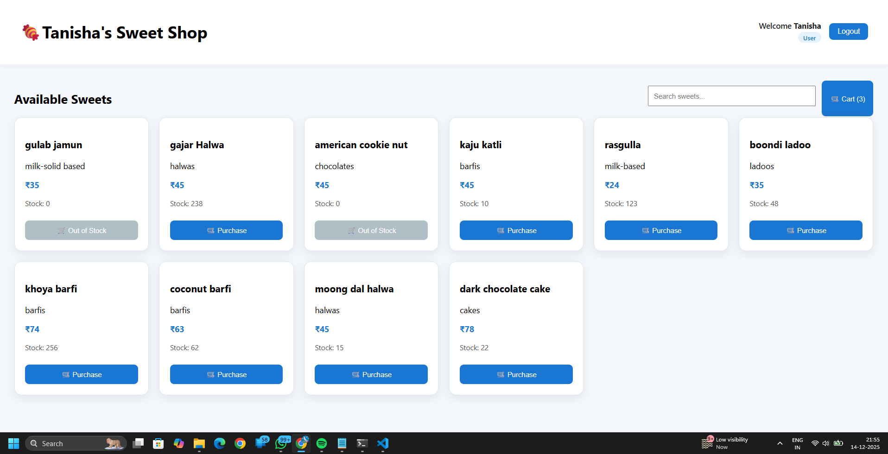

#### 🛠️ Admin Dashboard
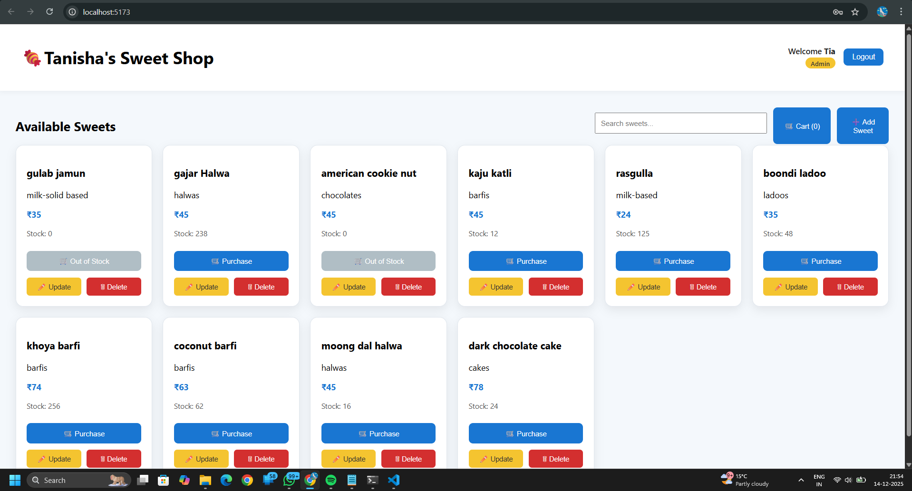

#### 🛒 User Cart
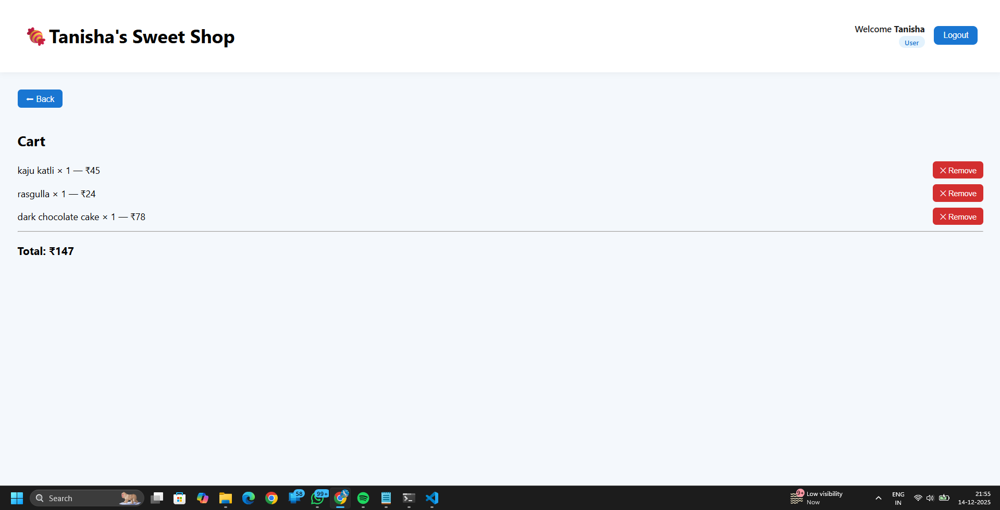

#### 🧺 Admin Cart
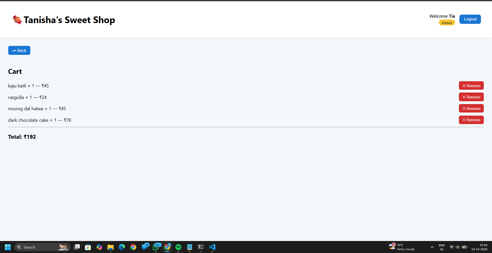

#### 🔍 Search Bar

---

### 🧠 Backend (API & Schema Screenshots)

#### 📡 API Requests
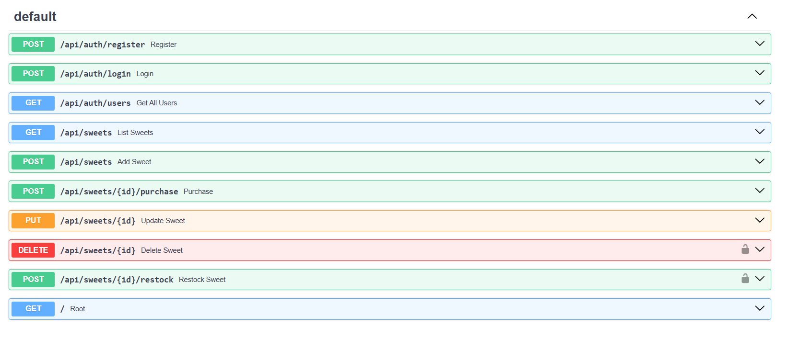

#### 🧾 Token Schema
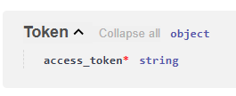

#### 👤 User Create Schema
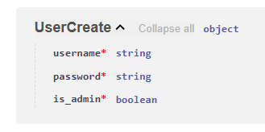

#### 🔑 User Login Schema
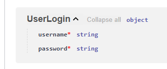

#### 👥 User Output Schema
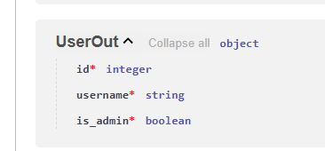

#### 🍬 Sweet Base Schema
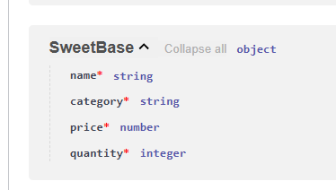

#### 🍭 Sweet Response Schema
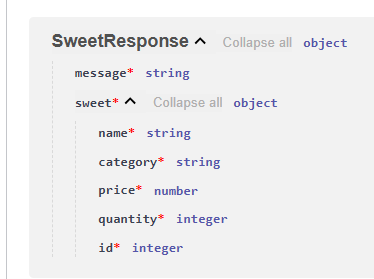

#### ✏️ Sweet Update Response Schema
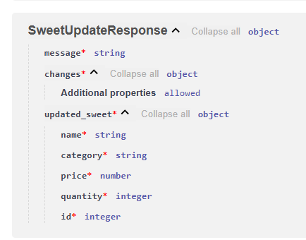

#### ⚠️ Validation Error Schema
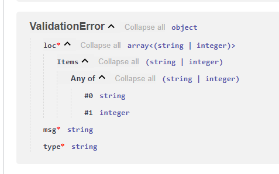

#### ❌ HTTP Validation Error Schema
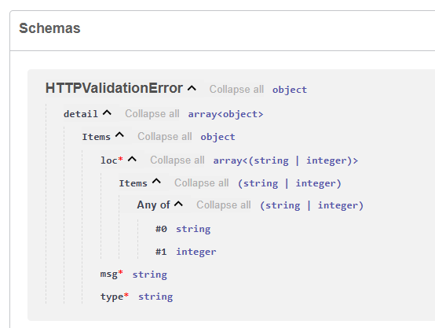

---

## ✨ Key Features

- User registration & login
- JWT-secured APIs
- Role-based access (Admin/User)
- Sweet CRUD operations (Admin)
- Search sweets by name, category, price
- Purchase & restock inventory
- Responsive, modern UI

---

## 🔗 API Endpoints

### Auth
| Method | Endpoint |
|------|---------|
| POST | `/api/auth/register` |
| POST | `/api/auth/login` |

### Sweets
| Method | Endpoint |
|------|---------|
| POST | `/api/sweets` |
| GET | `/api/sweets` |
| GET | `/api/sweets/search` |
| PUT | `/api/sweets/{id}` |
| DELETE | `/api/sweets/{id}` |

### Inventory
| Method | Endpoint |
|------|---------|
| POST | `/api/sweets/{id}/purchase` |
| POST | `/api/sweets/{id}/restock` |

## 🤖 My AI Usage

During the development of this project, I used AI tools as **supporting aids** to improve productivity and maintain clarity, while ensuring full understanding and ownership of the final code.

### 🔧 AI Tools Used
- **ChatGPT**
- **GitHub Copilot**

### 🛠️ How I Used AI
- I used **ChatGPT** to brainstorm and refine REST API structures for the FastAPI backend, understand JWT-based authentication flows, and validate database schema designs using Pydantic. It was also helpful in improving documentation and structuring the README clearly.
- I used **GitHub Copilot** to speed up repetitive tasks such as writing boilerplate code for FastAPI routes and schemas, and to assist with drafting unit.

### 💡 Reflection on AI Impact
Using AI made my development workflow faster and more efficient, especially during the initial setup and testing phases. It helped me focus more on application logic, edge cases, and overall system design rather than spending time on repetitive code.

All AI-generated suggestions were carefully reviewed, adapted, and tested manually to ensure they aligned with project requirements and best practices. AI was used strictly as a **productivity enhancer**, not as a substitute for problem-solving or decision-making.
